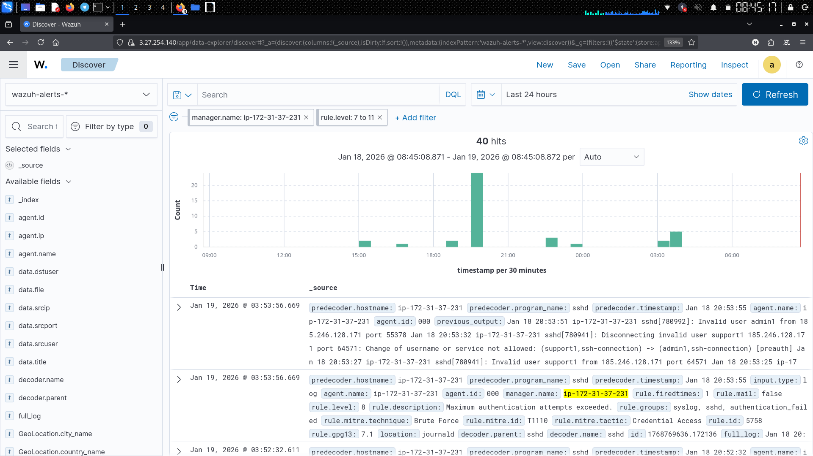
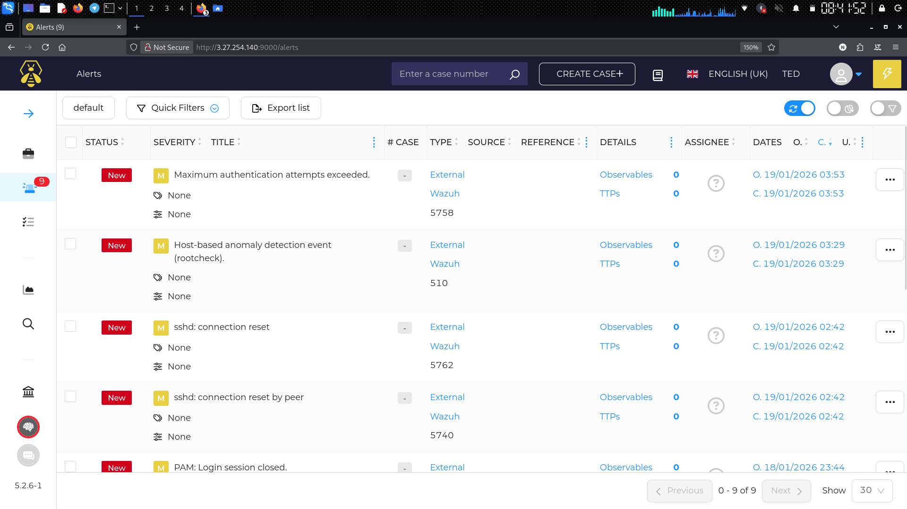
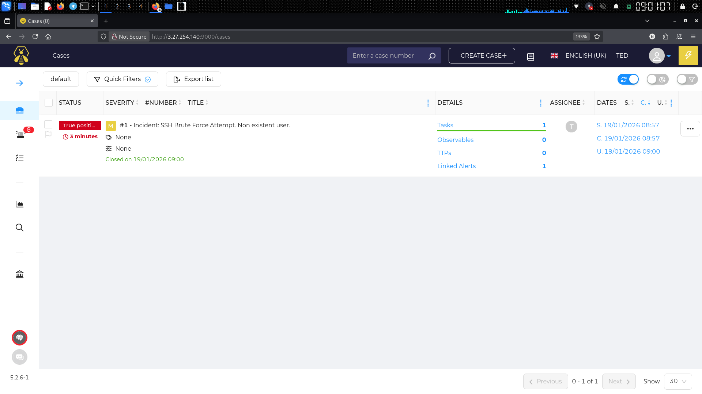

# 🛡️ Automated SOC Lab: SSH Brute Force Detection & Response

**Project Status:** ✅ Completed  
**Role:** Security Engineer / SOC Analyst  
**Tools:** Wazuh, Shuffle (SOAR), TheHive, Cortex, Kali Linux, AWS EC2.

## 📝 Project Overview
This project simulates a real-world Security Operations Center (SOC) environment. The mission was to build an automated IDS that detects **SSH Brute Force attacks** and automatically generates an incident ticket in a Case Management System, reducing the Mean Time to Response (MTTR) and eliminating alert.

## Architecture
There are will be three main stages:
1.  **Detection (Wazuh):** Monitors system logs on the target server (Ubuntu/AWS) and triggers alerts based on specific rules.
2.  **Orchestration (Shuffle):** Acts as the bridge or like a middleware (SOAR) to receive the alert via Webhook, parse the JSON payload, and restructure the data and send it to TheHove
3.  **Response (TheHive):** Receives the structured data from Shuffle and creates a new alert/case for the SOC Analyst to investigate.

---

## 📸 Workflow & Screenshots

### 1. The Attack & Detection
Me and my friend simulated a brute force attack using **Kali Linux**. Wazuh Agent on the victim server detected multiple authentication failures.

*Fig 1: Wazuh Dashboard showing a spike in authentication failures.*

### 2. The Automation (SOAR)
Shuffle receives the JSON payload from Wazuh. I configured a workflow to filter the data and map the variables (Title, Rule ID, Source IP) correctly for TheHive API.

*Fig 2: Shuffle Workflow successfully executing the automation logic.*

### 3. Incident Creation
The final result: An alert is automatically created in TheHive, containing all necessary details for investigation.

*Fig 3: The alert "sshd: brute force" appears in TheHive dashboard instantly.*

### 4. Case Management
As an analyst, I converted the alert into a case, performed IP reputation checks (simulated), and closed the case as a True Positive.

*Fig 4: Closing the case after investigation.*

---

## Challenges & Solutions
* **Log Parsing on Shuffle:** Wazuh sends raw JSON that isn't directly compatible with TheHive. I used Shuffle to re-map variables like `$exec.text` and `$exec.rule.id` to ensure the ticket contained readable information.
* **Port Forwarding:** Configured AWS Security Groups to allow communication between the Wazuh Manager (Port 55000), TheHive (Port 9000), and Shuffle Webhooks.

## Conclusion
This project demonstrates the power of SOAR in modern cybersecurity. By automating repetitive tasks (ticket creation), analysts can focus on threat hunting and more effective.
